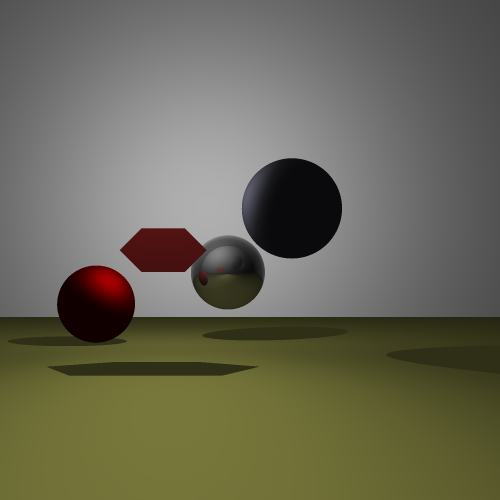
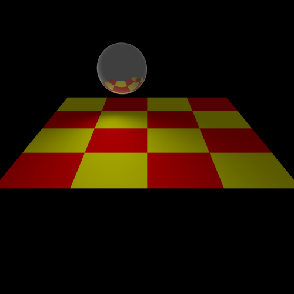
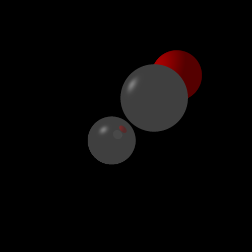

# ray_tracer
An OpenGL type recursive ray tracing implementation in Java for rendering views for course on Computer Graphics at IIT Delhi

For more details refer to [problem_statement.pdf](problem_statement.pdf)

# Running

```sh
$ cd src
$ javac -cp json-20171018.jar *.java
$ java -cp .:json-20171018.jar Main input_file output_file supersampling_grid_size
```

To get started some sample config files have been provided. 

# Demo

```sh
$ bash demo.sh
```

# Examples




